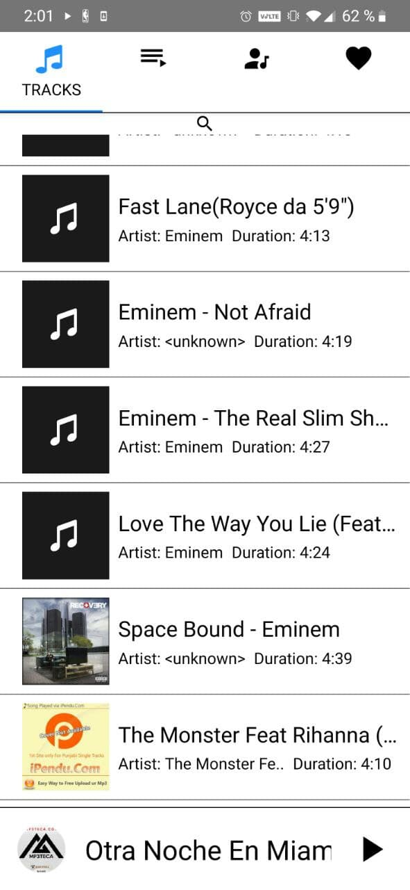

# :notes: SHUMUSIC :notes:

A simple music player made with react-native. For android devices only. 

 

# 

Fourth personal project. Hope you like it :eyes: :raised_hands:

#

## BASIC FUNCTIONS:

### 

* Play :arrow_forward:
* Pause :hand:
* Previous song :rewind:
* Next song :fast_forward:
* Repeat queue :repeat:
* Repeat song :repeat_one:
* Shuffle :twisted_rightwards_arrows:
 
##

### EXTRA FEATURES:

* Lycrics :pencil:

## Samples:

###
 <table>
   <tr>
     <td></td>
     <td aling = "center"></td>
     <td aling = "right"></td>
   </tr>
 </table>
